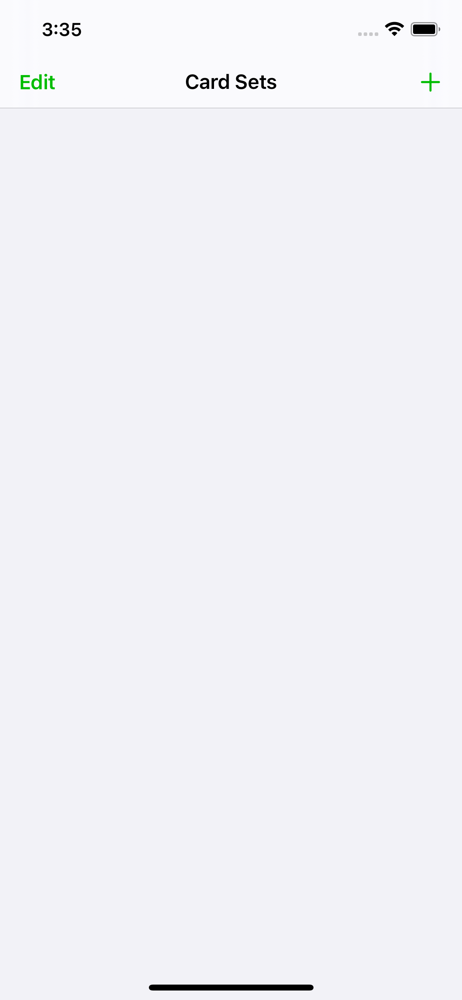
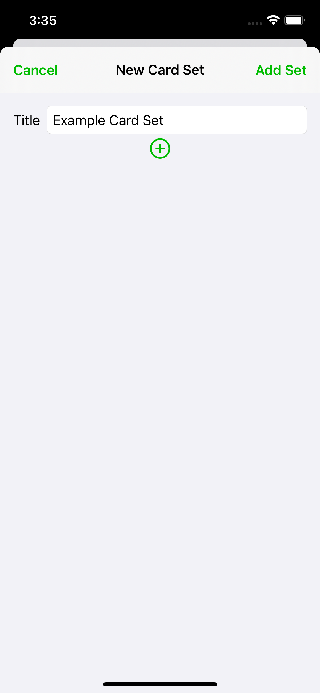
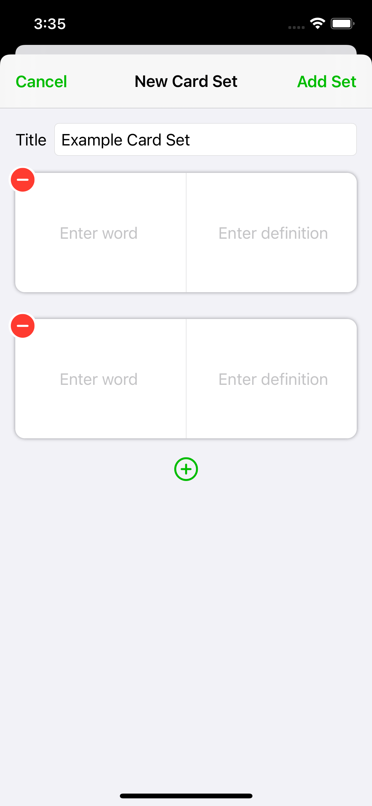
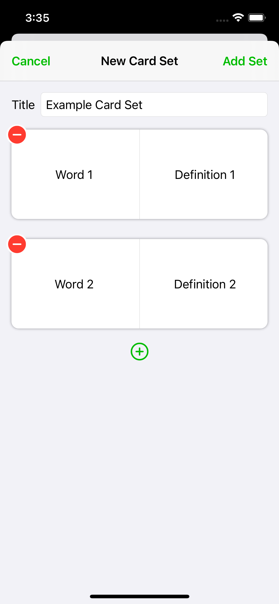
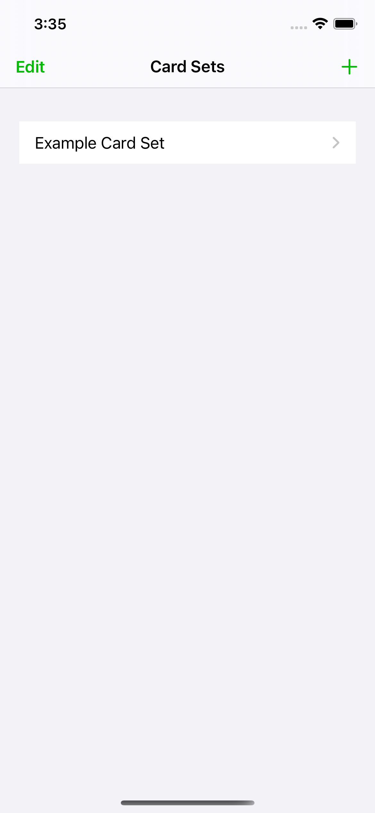
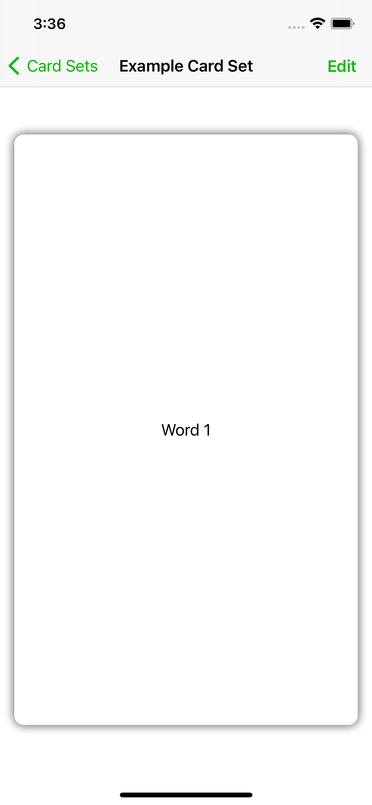
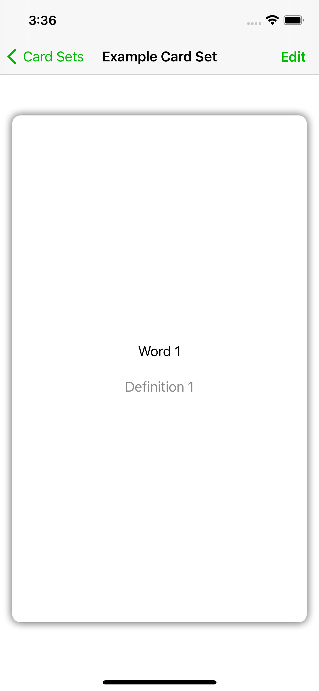

# Flashcards

Simple iOS/macOS app that allows the user to generate custom flashcards to study from. The app is written in SwiftUI and uses CoreData and CloudKit.

This project has not yet been completed, and has been shelved for now. It served as a great introduction to CloudKit, and was good practice using SwiftUI.

